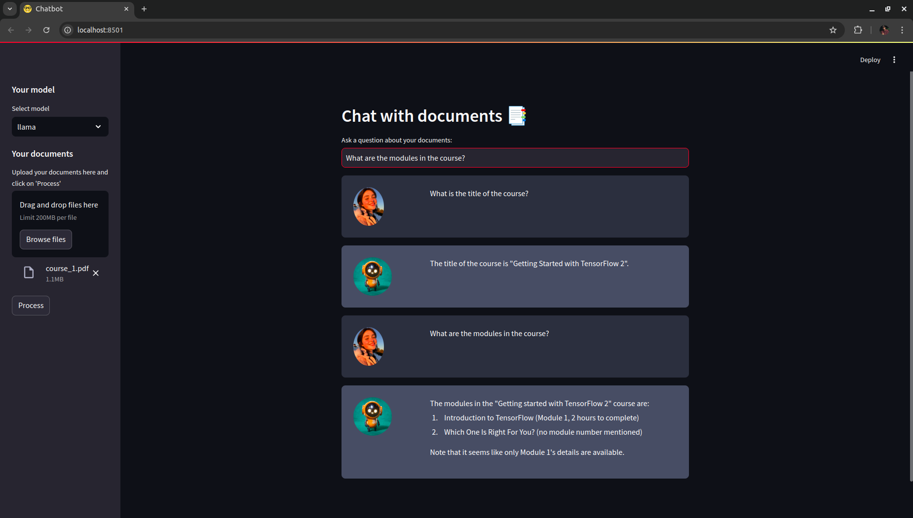

# chat-with-docs

<table>
  <tr>
    <th>Stacks</th>
    <th></th>
  </tr>
  <tr>
    <td align="left">Framework</td>
    <td align="left">Langchain</td>
  </tr>
  <tr>
    <td align="left">Vector DB</td>
    <td align="left">Chroma in docker</td>
  </tr>
  <tr>
    <td align="left">Embedding</td>
    <td align="left">sentence-transformers/all-MiniLM-L6-v2</td>
  </tr>
  <tr>
    <td align="left">LLM</td>
    <td align="left">gpt-3.5-turbo or llama3.1:latest</td>
  </tr>
  <tr>
    <td align="left">Web / Display</td>
    <td align="left">Streamlit</td>
  </tr>
</table>


<p align="center" >
  
</p>

## Getting Started

Setting up, install necessary libraries/packages
```
pip install -r requirements.txt
```

Input your API KEY(s) in `.env`, this project is using `OpenAI` and `HuggingFace` API KEY. In addition, input the `Chroma DB` configs<br>
```
OPENAI_API_KEY=sk-proj-4- ...
HUGGINGFACE_API_TOKEN=hf_ ...
CHROMA_HOST="localhost"
CHROMA_PORT="8005"
CHROMA_COLLECTION_NAME="dev-collection"
```

### Start docker container
Start `Chroma DB` container
```
docker compose up -d
```

### Start Application
```
Streamlit run app.py
```
then open http://localhost:8501/